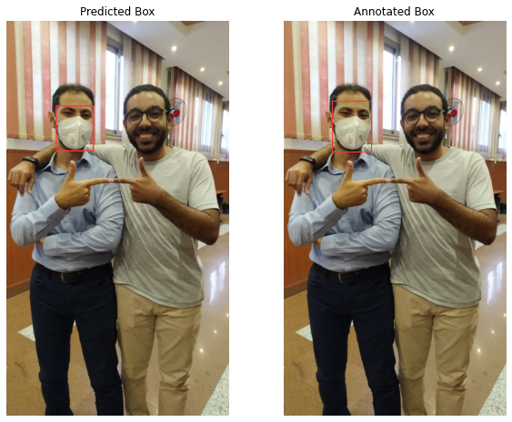
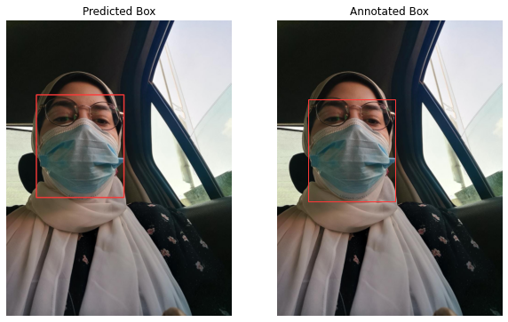

# Facemask-Detection.
In this project, we used YOLO-V5 to detect face masks on our own collected dataset that was preprocessed, augmented and annotated. 

1. We collected our dataset in-the-wild, having diverse images considering the Arab culture of veiled and un-velied women. The images had positive examples as people wearing masks correctly and negative ones for either no masks, incorrectly work masks *(i.e. covering only the mouth)*, or bare masks. 
The images varied between having single person, multiple people, close or far-away views. 

2. A whole preprocessing pipeline was made to annotate (using KILI technology) and split our images into train/val/test sets in order to be fed to the model. 
3. Different Augmentation techniques were applied as Brightness and contrast adjustments, Addition of Gaussian noise and Blurring. 
4. Various experiments were performed to tune our model until we reached the best combination of hyperparameters, given our resources. 
5. Moreover, error analysis was applied to define the model weaknesses and propose next steps for future work.

We can see from the sample below images how our model aligns with the actual annotation of the images.

